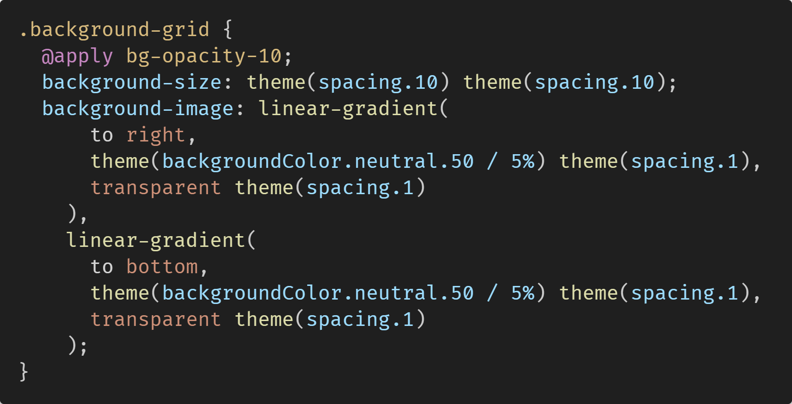
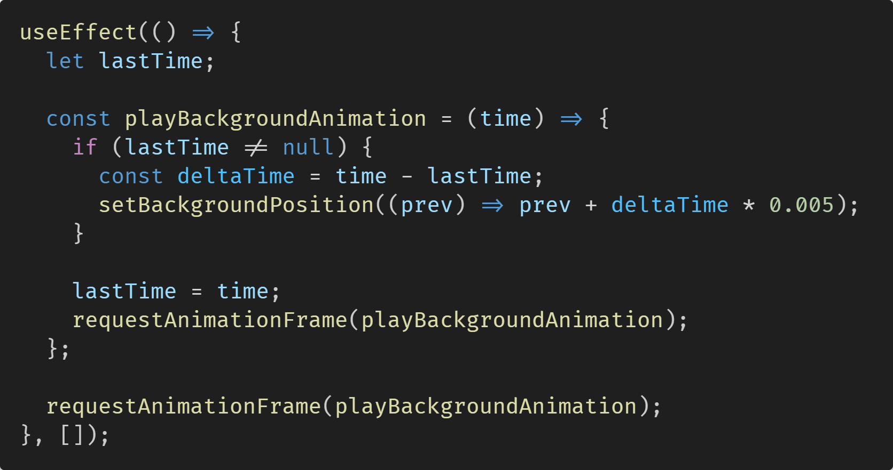
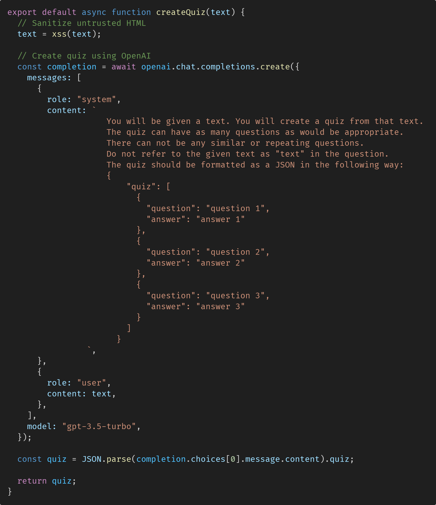
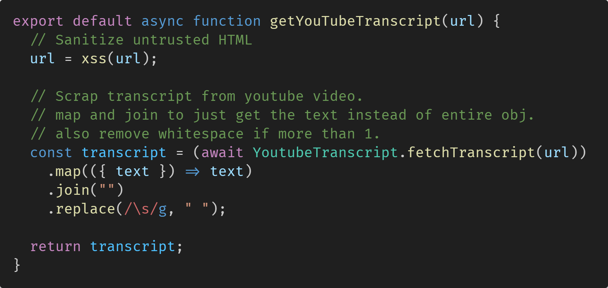

# Quiz Me

_Makes text, documents and youtube videos into flashcards using OpenAI._


## About

**URL:** https://quiz-me-production.up.railway.app/ <br>
**Created by:** [Mike Newberry](https://github.com/MikeNewXYZ)

**_I created this project as a challenge to myself when learning to NEXTJS. It uses the OpenAI API to convert text, documents and transcripts from YouTube vidoes into flashcards._**

</br>

## 💻 Installing

```console
> git clone https://github.com/MikeNewXYZ/quiz-me.git
```

```console
> npm i
> npm run dev
```

</br>

## How it works!

### 🎨 How did I make the animated background?

[](./app/globals.css)
[](./components/background/background.js)
The background itself is made using a repeating linear gradient. It is animated using the requestAnimationFrame method, which calls its callback ever frame tick, to move the background position.

## 🤖 How are the flashcards generated?

[](./lib/createQuiz.js)
The quiz is generated using ChatGPT, specifically using the "GPT 3.5 Turbo" model, using the OpenAI API. It simply takes in instructions shown above and using that outputs a response in JSON. The response should contain an array of questions.

## 📹 How do I get the YouTube transcript?

[](./lib/getYouTubeTranscript.js)
I get the transcript from a YouTube video using a cheeky method. If I were to use the offical YouTube API I would need to get permission from the video creator, luckily theres a library called [youtube-transcript](https://www.npmjs.com/package/youtube-transcript) which does some wizardry.
